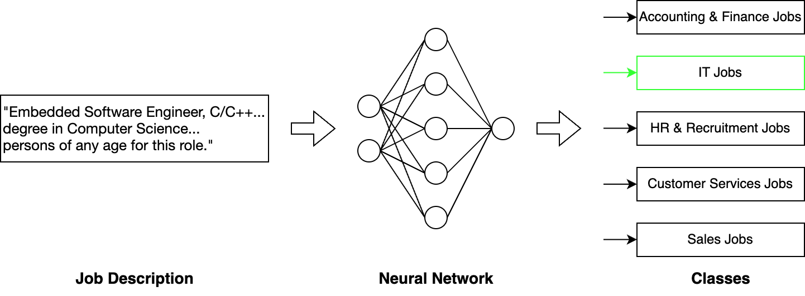
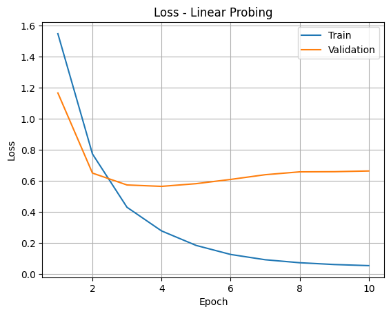
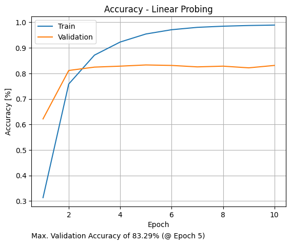
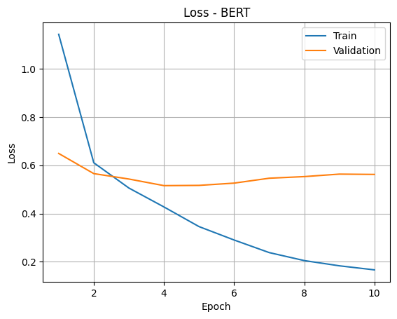
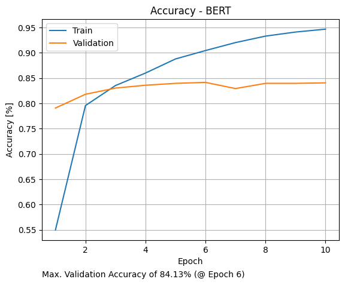

# Job Description Classification
This repository serves as an implementation of a text classification algorithm based on job descriptions with TensorFlow. The project aims on estimating the job type based on a given job description. The algorithm is developed based on a dataset consisting of over 8000 job descriptions spanning the classes "Accounting & Finance Jobs", "HR & Recruitment Jobs", "IT Jobs", "Customer Services Jobs" and "Sales Jobs". For the classification model two approaches are taken: linear probing with a pre-trained embedding and a linear layer as classification head as well as finetuning a BERT model.

<p align="middle">
    
</p>

<p align="center"> Figure 1: Scheme of the classification workflow in this project. </p>

## Getting started
### Installation

Environments:

- Python 3.8
- TensorFlow 2.13

Install the dependencies:

```
pip install -r requirements.txt
```

### Demo

- Run `task.py` as a module:

```
python -m trainer.task
```

- Modify the model and training parameters via command line flags

- Possible parameter flags are provided by running

```
python -m trainer.task --help
```

## Results
In this section results of the classifier models on the validation set are presented. Both models quickly show signs of overfitting and show a similar performance of around 83-84% on the validation set (see Figure 2 and 3). Possible solutions to prevent the overfitting behavior might be data augmentation and stronger regularization techniques.

| Model                                                         | Train Accuracy | Val Accuracy |
| ------------------------------------------------------------- | :------------: | :----------: |
| Linear Probing (NNLM Embedding + Linear Classification Head)  | 0.982          | 0.833        |
| Finetuned BERT (small)                                        | 0.949          | 0.841        |

<p align="middle">
    
    
</p>

<p align="center"> Figure 2: Loss (left) and accuracy (right) of the linear probing approach. </p>


<p align="middle">
    
    
</p>

<p align="center"> Figure 3: Loss (left) and accuracy (right) of the BERT finetuning. </p>